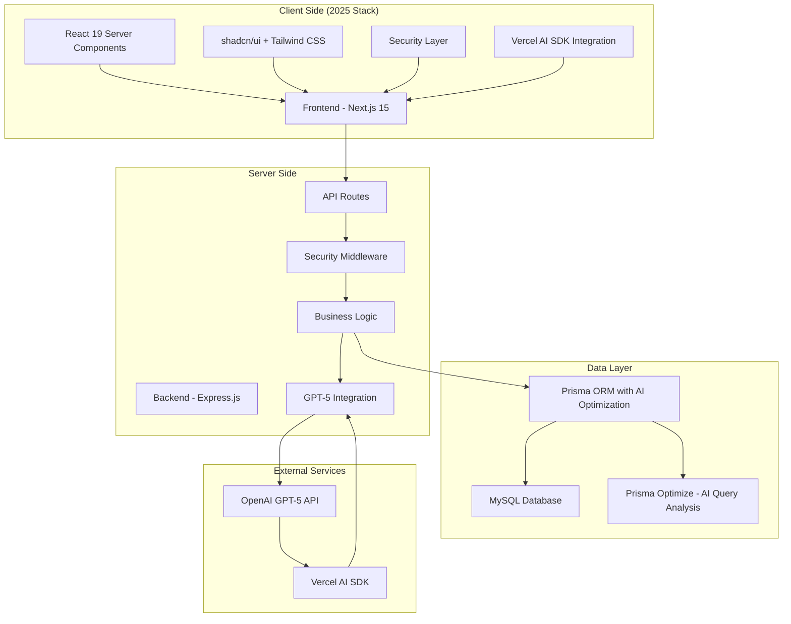

# System Architecture

## Overview

Quiz Generator Platform采用前端后端分离架构，使用**最新2025年技术栈**构建高性能、可扩展的SaaS应用。基于research terbaru，我们采用Next.js 15 + React 19 + GPT-5等最前沿技术。

## Architecture Diagram



## Frontend Architecture

### Technology Stack (2025 Latest)
- **Framework**: Next.js 15 dengan App Router + Partial Prerendering (PPR)
- **Language**: TypeScript 5.8+ dengan enhanced type safety
- **UI Library**: shadcn/ui + Radix UI + Tailwind CSS 4.0+
- **State Management**: Zustand dengan React 19 concurrent features
- **Forms**: React Hook Form + Zod dengan React Server Actions
- **HTTP Client**: Built-in Fetch API dengan enhanced caching
- **Icons**: Lucide React
- **AI Integration**: Vercel AI SDK untuk GPT-5
- **Security**: Firebase App Check untuk API protection

### Directory Structure
```
frontend/
├── app/                    # Next.js App Router
│   ├── (auth)/            # Authentication routes
│   ├── (dashboard)/       # Dashboard routes
│   │   ├── quizzes/       # Quiz management
│   │   ├── questions/     # Question management
│   │   ├── ai-assistant/  # AI Assistant
│   │   └── analytics/     # Analytics
│   ├── quiz/              # Quiz taking interface
│   └── api/               # API routes
├── components/
│   ├── ui/                # shadcn/ui components
│   ├── dashboard/         # Dashboard components
│   ├── quiz/              # Quiz components
│   ├── security/          # Security components
│   └── forms/             # Form components
├── lib/
│   ├── auth/              # Authentication utilities
│   ├── api/               # API client
│   ├── utils/             # Utility functions
│   └── hooks/             # Custom hooks
├── hooks/                 # Global state hooks
├── store/                 # Zustand stores
└── types/                 # TypeScript types
```

### Key Architectural Patterns

#### 1. Server Components vs Client Components
```typescript
// Server Component - untuk data fetching
export default async function QuizPage() {
  const quizzes = await getQuizzes();
  return <QuizList quizzes={quizzes} />;
}

// Client Component - untuk interactivity
'use client';
export default function QuizBuilder() {
  const [questions, setQuestions] = useState([]);
  // Interactive logic
}
```

#### 2. Layout Components
```typescript
// app/(dashboard)/layout.tsx
export default function DashboardLayout({
  children,
}: {
  children: React.ReactNode;
}) {
  return (
    <div className="flex h-screen">
      <Sidebar />
      <main className="flex-1">{children}</main>
    </div>
  );
}
```

#### 3. API Client Pattern
```typescript
// lib/api/client.ts
class ApiClient {
  private baseURL: string;

  constructor(baseURL: string) {
    this.baseURL = baseURL;
  }

  async get<T>(endpoint: string): Promise<T> {
    const response = await fetch(`${this.baseURL}${endpoint}`);
    if (!response.ok) throw new Error('API request failed');
    return response.json();
  }

  async post<T>(endpoint: string, data: any): Promise<T> {
    const response = await fetch(`${this.baseURL}${endpoint}`, {
      method: 'POST',
      headers: { 'Content-Type': 'application/json' },
      body: JSON.stringify(data),
    });
    return response.json();
  }
}
```

## Backend Architecture

### Technology Stack
- **Runtime**: Node.js
- **Framework**: Express.js dengan TypeScript
- **Database**: MySQL dengan Prisma ORM
- **Authentication**: JWT dengan bcryptjs
- **Validation**: Zod schemas
- **Security**: Helmet, CORS, rate limiting
- **AI Integration**: OpenAI API (GPT-5)

### Directory Structure
```
backend/
├── src/
│   ├── controllers/       # Request handlers
│   ├── middleware/        # Custom middleware
│   │   ├── auth.ts        # Authentication middleware
│   │   ├── security.ts    # Security middleware
│   │   └── validation.ts  # Input validation
│   ├── routes/            # API route definitions
│   │   ├── auth.ts        # Authentication routes
│   │   ├── questions.ts   # Question management
│   │   ├── quizzes.ts     # Quiz management
│   │   ├── ai.ts          # AI Assistant
│   │   └── analytics.ts   # Analytics
│   ├── services/          # Business logic
│   │   ├── auth.service.ts
│   │   ├── question.service.ts
│   │   ├── quiz.service.ts
│   │   ├── ai.service.ts
│   │   └── security.service.ts
│   ├── models/            # Data models
│   ├── utils/             # Utility functions
│   └── types/             # TypeScript types
├── prisma/
│   ├── schema.prisma      # Database schema
│   ├── migrations/        # Database migrations
│   └── seed.ts           # Seed data
├── tests/                 # Test files
└── docs/                  # API documentation
```

### Key Architectural Patterns

#### 1. Controller-Service-Repository Pattern
```typescript
// Controller - handles HTTP requests
export class QuizController {
  constructor(private quizService: QuizService) {}

  async createQuiz(req: Request, res: Response) {
    const quiz = await this.quizService.create(req.body);
    res.json(quiz);
  }
}

// Service - contains business logic
export class QuizService {
  constructor(private quizRepository: QuizRepository) {}

  async create(data: CreateQuizDto): Promise<Quiz> {
    // Business logic validation
    const validatedData = CreateQuizSchema.parse(data);
    return await this.quizRepository.create(validatedData);
  }
}

// Repository - handles data access
export class QuizRepository {
  async create(data: CreateQuizDto): Promise<Quiz> {
    return await prisma.quiz.create({ data });
  }
}
```

#### 2. Middleware Chain
```typescript
// app.ts
app.use(helmet());
app.use(cors({ origin: process.env.FRONTEND_URL }));
app.use(rateLimit({ windowMs: 15 * 60 * 1000, max: 100 }));
app.use(express.json());

// Authentication middleware
app.use('/api/auth', authRoutes);
app.use('/api/quizzes', authenticateToken, quizRoutes);
app.use('/api/questions', authenticateToken, questionRoutes);
```

#### 3. Validation with Zod
```typescript
// schemas/quiz.schema.ts
export const CreateQuizSchema = z.object({
  title: z.string().min(1).max(255),
  description: z.string().optional(),
  timeLimit: z.number().positive().optional(),
  enableAntiCopy: z.boolean().default(true),
});

// Controller usage
try {
  const validatedData = CreateQuizSchema.parse(req.body);
  const quiz = await this.quizService.create(validatedData);
  res.json(quiz);
} catch (error) {
  res.status(400).json({ error: error.errors });
}
```

## Database Architecture

### Schema Design Principles
- **Normalization**: Relational design untuk optimal performance
- **Indexing**: Strategic indexes untuk query optimization
- **Security**: Sensitive data encryption
- **Scalability**: Design untuk horizontal scaling

### Key Tables
```sql
-- Users table
CREATE TABLE users (
  id VARCHAR(255) PRIMARY KEY,
  email VARCHAR(255) UNIQUE NOT NULL,
  password_hash VARCHAR(255) NOT NULL,
  name VARCHAR(255),
  created_at TIMESTAMP DEFAULT CURRENT_TIMESTAMP,
  updated_at TIMESTAMP DEFAULT CURRENT_TIMESTAMP ON UPDATE CURRENT_TIMESTAMP
);

-- Questions table
CREATE TABLE questions (
  id VARCHAR(255) PRIMARY KEY,
  question_bank_id VARCHAR(255) NOT NULL,
  category_id VARCHAR(255),
  type ENUM('MULTIPLE_CHOICE', 'ESSAY', 'TRUE_FALSE', 'FILL_BLANK') NOT NULL,
  question_text TEXT NOT NULL,
  max_points INT DEFAULT 1,
  difficulty ENUM('EASY', 'MEDIUM', 'HARD', 'EXPERT') DEFAULT 'MEDIUM',
  ai_generated BOOLEAN DEFAULT FALSE,
  created_at TIMESTAMP DEFAULT CURRENT_TIMESTAMP,
  updated_at TIMESTAMP DEFAULT CURRENT_TIMESTAMP ON UPDATE CURRENT_TIMESTAMP,
  FOREIGN KEY (question_bank_id) REFERENCES question_banks(id),
  FOREIGN KEY (category_id) REFERENCES categories(id)
);

-- Options table with per-option scoring
CREATE TABLE options (
  id VARCHAR(255) PRIMARY KEY,
  question_id VARCHAR(255) NOT NULL,
  option_text VARCHAR(255) NOT NULL,
  points INT DEFAULT 0,
  is_correct BOOLEAN DEFAULT FALSE,
  `order` INT DEFAULT 0,
  FOREIGN KEY (question_id) REFERENCES questions(id) ON DELETE CASCADE
);
```

## Security Architecture

### Multi-Layer Security Approach

#### 1. Client-Side Security
```typescript
// SecurityProvider Component
export const SecurityProvider: React.FC<{
  children: React.ReactNode;
  enableAntiCopy: boolean;
}> = ({ children, enableAntiCopy }) => {
  useEffect(() => {
    if (!enableAntiCopy) return;

    // Prevent text selection
    document.addEventListener('selectstart', preventSelection);
    document.addEventListener('contextmenu', preventContextMenu);
    document.addEventListener('copy', preventCopy);
    document.addEventListener('keydown', preventKeyboardShortcuts);

    return () => {
      // Cleanup listeners
    };
  }, [enableAntiCopy]);
};
```

#### 2. Server-Side Security
```typescript
// Security middleware
export const securityMiddleware = (req: Request, res: Response, next: NextFunction) => {
  // Log suspicious activities
  logSecurityEvent(req.ip, req.method, req.url);
  
  // Rate limiting
  if (isRateLimited(req.ip)) {
    return res.status(429).json({ error: 'Too many requests' });
  }
  
  next();
};
```

#### 3. Data Protection
```typescript
// Encryption for sensitive data
export const encryptSensitiveData = (data: string): string => {
  const cipher = crypto.createCipher('aes-256-cbc', process.env.ENCRYPTION_KEY);
  return cipher.update(data, 'utf8', 'hex') + cipher.final('hex');
};
```

## API Architecture

### RESTful API Design
```typescript
// API Routes Structure
/api/v1/
├── /auth
│   ├── POST /login
│   ├── POST /register
│   ├── POST /refresh
│   └── POST /logout
├── /questions
│   ├── GET /
│   ├── POST /
│   ├── GET /:id
│   ├── PUT /:id
│   ├── DELETE /:id
│   └── POST /search
├── /quizzes
│   ├── GET /
│   ├── POST /
│   ├── GET /:id
│   ├── PUT /:id
│   ├── DELETE /:id
│   ├── POST /:id/publish
│   └── GET /:id/results
├── /ai
│   ├── POST /chat
│   ├── POST /generate-questions
│   └── GET /prompts
└── /analytics
    ├── GET /overview
    ├── GET /quiz/:id/performance
    └── GET /security/events
```

### Request/Response Patterns
```typescript
// Standard API Response
interface ApiResponse<T> {
  success: boolean;
  data?: T;
  error?: string;
  message?: string;
  timestamp: string;
}

// Pagination
interface PaginatedResponse<T> extends ApiResponse<T[]> {
  pagination: {
    page: number;
    limit: number;
    total: number;
    totalPages: number;
  };
}
```

## Performance Architecture

### Optimization Strategies

#### 1. Frontend Optimization
```typescript
// Dynamic imports untuk code splitting
const QuizBuilder = dynamic(() => import('./QuizBuilder'), {
  loading: () => <div>Loading...</div>,
});

// Image optimization
export const OptimizedImage = ({ src, alt }: { src: string; alt: string }) => (
  <Image src={src} alt={alt} width={500} height={300} loading="lazy" />
);
```

#### 2. Backend Optimization
```typescript
// Database query optimization
export const getQuestionsWithFilters = async (filters: QuestionFilters) => {
  return await prisma.question.findMany({
    where: {
      AND: [
        filters.categoryId && { categoryId: filters.categoryId },
        filters.difficulty && { difficulty: filters.difficulty },
        filters.tags && { tags: { hasSome: filters.tags } },
      ].filter(Boolean),
    },
    include: { options: true },
    orderBy: { createdAt: 'desc' },
    take: filters.limit,
    skip: filters.offset,
  });
};

// Caching strategy
export const getCachedQuestions = async (cacheKey: string) => {
  const cached = await redis.get(cacheKey);
  if (cached) return JSON.parse(cached);
  
  const questions = await getQuestionsWithFilters({});
  await redis.setex(cacheKey, 300, JSON.stringify(questions));
  return questions;
};
```

## Scalability Architecture

### Horizontal Scaling Strategy

#### 1. Load Balancing
```yaml
# PM2 Configuration for clustering
module.exports = {
  apps: [
    {
      name: 'quiz-backend',
      script: './dist/index.js',
      instances: 'max',
      exec_mode: 'cluster',
      env: {
        NODE_ENV: 'production',
        PORT: 3001
      }
    }
  ]
};
```

#### 2. Database Scaling
```sql
-- Read replicas for read-heavy operations
CREATE TABLE questions_read_replica LIKE questions;
-- Setup replication for read operations

-- Connection pooling
const prisma = new PrismaClient({
  datasources: {
    db: {
      url: process.env.DATABASE_URL,
    },
  },
  // Connection pool configuration
});
```

## Monitoring & Observability

### Logging Strategy
```typescript
// Structured logging
export const logger = winston.createLogger({
  format: winston.format.combine(
    winston.format.timestamp(),
    winston.format.errors({ stack: true }),
    winston.format.json()
  ),
  transports: [
    new winston.transports.File({ filename: 'error.log', level: 'error' }),
    new winston.transports.File({ filename: 'combined.log' }),
  ],
});

// API request logging
app.use((req, res, next) => {
  logger.info('API Request', {
    method: req.method,
    url: req.url,
    ip: req.ip,
    userAgent: req.get('User-Agent'),
  });
  next();
});
```

### Health Checks
```typescript
// Health check endpoint
app.get('/health', async (req, res) => {
  const health = {
    status: 'ok',
    timestamp: new Date().toISOString(),
    uptime: process.uptime(),
    database: await checkDatabaseConnection(),
    ai: await checkOpenAIConnection(),
  };
  
  res.json(health);
});
```

This architecture ensures the platform is scalable, maintainable, and secure while providing excellent performance for both frontend and backend operations.
