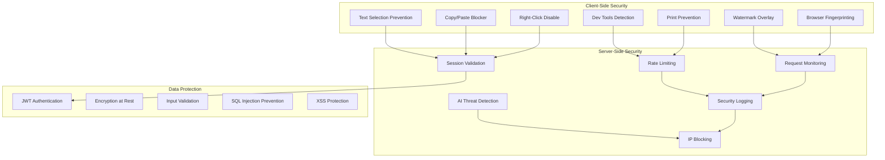

# Security Implementation Guide

## Overview

Comprehensive security implementation untuk Quiz Generator Platform dengan multi-layer protection, real-time monitoring, dan AI-enhanced threat detection. Platform dirancang untuk mencegah berbagai jenis cheating dan security violations dalam quiz environment.

## Security Architecture



## Client-Side Security Implementation

### 1. Text Selection Prevention
```typescript
'use client';

import { useEffect, useRef } from 'react';

export const TextSelectionProtection: React.FC<{
  children: React.ReactNode;
  enabled: boolean;
}> = ({ children, enabled }) => {
  const containerRef = useRef<HTMLDivElement>(null);

  useEffect(() => {
    if (!enabled || !containerRef.current) return;

    const preventSelection = (e: Event) => {
      e.preventDefault();
      e.stopPropagation();
      return false;
    };

    const preventCopy = (e: ClipboardEvent) => {
      e.preventDefault();
      e.stopPropagation();
      return false;
    };

    const preventContextMenu = (e: MouseEvent) => {
      e.preventDefault();
      e.stopPropagation();
      return false;
    };

    const preventKeyboardShortcuts = (e: KeyboardEvent) => {
      // Prevent Ctrl+A, Ctrl+C, Ctrl+V, Ctrl+S, Ctrl+P, Ctrl+X
      if (
        (e.ctrlKey || e.metaKey) &&
        ['a', 'c', 'v', 's', 'p', 'x'].includes(e.key.toLowerCase())
      ) {
        e.preventDefault();
        return false;
      }
    };

    const container = containerRef.current;
    
    // Add event listeners
    container.addEventListener('selectstart', preventSelection, true);
    container.addEventListener('mousedown', preventSelection, true);
    container.addEventListener('contextmenu', preventContextMenu, true);
    container.addEventListener('copy', preventCopy, true);
    container.addEventListener('keydown', preventKeyboardShortcuts, true);

    // Apply CSS styles
    container.style.userSelect = 'none';
    container.style.webkitUserSelect = 'none';
    container.style.mozUserSelect = 'none';
    container.style.msUserSelect = 'none';

    return () => {
      container.removeEventListener('selectstart', preventSelection, true);
      container.removeEventListener('mousedown', preventSelection, true);
      container.removeEventListener('contextmenu', preventContextMenu, true);
      container.removeEventListener('copy', preventCopy, true);
      container.removeEventListener('keydown', preventKeyboardShortcuts, true);
    };
  }, [enabled]);

  return (
    <div ref={containerRef} className="select-none">
      {children}
    </div>
  );
};
```

### 2. Developer Tools Detection
```typescript
'use client';

export const DevToolsDetection: React.FC<{
  onDetection: () => void;
}> = ({ onDetection }) => {
  const checkDevTools = () => {
    const threshold = 160;
    const widthDiff = window.outerHeight - window.innerHeight;
    const heightDiff = window.outerWidth - window.innerWidth;
    
    if (widthDiff > threshold || heightDiff > threshold) {
      onDetection();
    }
  };

  useEffect(() => {
    const interval = setInterval(checkDevTools, 1000);
    return () => clearInterval(interval);
  }, []);

  return null;
};
```

### 3. Tab Switching Detection
```typescript
'use client';

export const TabSwitchingDetection: React.FC<{
  onTabSwitch: () => void;
}> = ({ onTabSwitch }) => {
  useEffect(() => {
    const handleVisibilityChange = () => {
      if (document.hidden) {
        onTabSwitch();
      }
    };

    document.addEventListener('visibilitychange', handleVisibilityChange);
    
    return () => {
      document.removeEventListener('visibilitychange', handleVisibilityChange);
    };
  }, [onTabSwitch]);

  return null;
};
```

### 4. Watermark Overlay
```typescript
'use client';

export const WatermarkProtection: React.FC<{
  text?: string;
  opacity?: number;
}> = ({ text = 'PROTECTED', opacity = 0.1 }) => {
  return (
    <div 
      className="fixed inset-0 pointer-events-none z-50 flex items-center justify-center"
      style={{
        background: `repeating-linear-gradient(
          45deg,
          transparent,
          transparent 10px,
          rgba(0, 0, 0, ${opacity}) 10px,
          transparent 10px,
          transparent 20px
        )`,
        fontSize: '72px',
        color: 'rgba(0, 0, 0, 0.05)',
        fontWeight: 'bold',
        transform: 'rotate(-45deg)',
        whiteSpace: 'nowrap',
        pointerEvents: 'none',
        userSelect: 'none'
      }}
    >
      {text}
    </div>
  );
};
```

### 5. Browser Fingerprinting
```typescript
// Fingerprinting utilities
export const generateFingerprint = async (): Promise<string> => {
  const canvas = document.createElement('canvas');
  const ctx = canvas.getContext('2d');
  
  // Canvas fingerprint
  ctx.textBaseline = 'top';
  ctx.font = '14px Arial';
  ctx.fillText('Browser fingerprint', 2, 2);
  const canvasFingerprint = canvas.toDataURL();

  // WebGL fingerprint
  const gl = canvas.getContext('webgl');
  const debugInfo = gl?.getExtension('WEBGL_debug_renderer_info');
  const webglFingerprint = debugInfo 
    ? `${debugInfo.UNMASKED_VENDOR_WEBGL}-${debugInfo.UNMASKED_RENDERER_WEBGL}`
    : '';

  // Combine all fingerprints
  const combinedFingerprint = [
    navigator.userAgent,
    navigator.language,
    screen.width + 'x' + screen.height,
    canvasFingerprint,
    webglFingerprint,
    new Date().getTimezoneOffset().toString(),
  ].join('|');

  // Generate hash
  const encoder = new TextEncoder();
  const data = encoder.encode(combinedFingerprint);
  const hashBuffer = await crypto.subtle.digest('SHA-256', data);
  const hashArray = Array.from(new Uint8Array(hashBuffer));
  const hashHex = hashArray.map(b => btoa(String.fromCharCode(b))).join('');
  
  return hashHex;
};
```

## Server-Side Security Implementation

### 1. Security Middleware
```typescript
// Security middleware
export const securityMiddleware = (req: Request, res: Response, next: NextFunction) => {
  // Log security events
  logSecurityEvent({
    ip: getClientIP(req),
    method: req.method,
    url: req.url,
    userAgent: req.headers['user-agent'],
    timestamp: new Date(),
  });

  // Rate limiting
  if (isRateLimited(getClientIP(req))) {
    return res.status(429).json({
      error: 'Rate limit exceeded',
      message: 'Too many requests from this IP',
    });
  }

  // Validate session
  const sessionToken = req.headers.authorization?.replace('Bearer ', '');
  if (sessionToken && !isValidSession(sessionToken)) {
    return res.status(401).json({
      error: 'Invalid session',
      message: 'Your session has expired',
    });
  }

  next();
};
```

### 2. AI Threat Detection
```typescript
// AI-powered security monitoring
export class AIThreatDetector {
  private model: OpenAI;

  constructor(apiKey: string) {
    this.model = new OpenAI({ apiKey });
  }

  async analyzeBehavior(session: QuizSession): Promise<ThreatAssessment> {
    const prompt = `
      Analyze this quiz session behavior for potential cheating:
      
      Session Details:
      - Duration: ${session.totalTime}s
      Questions: ${session.answers?.length || 0}
      Security events: ${JSON.stringify(session.suspiciousActivities)}
      IP: ${session.ipAddress}
      Browser info: ${JSON.stringify(session.browserInfo)}
      
      Return JSON with:
      {
        "threatScore": 0-100,
        "riskLevel": "low|medium|high|critical",
        "recommendations": ["string"],
        "suspiciousPatterns": ["string"]
      }
    `;

    try {
      const response = await this.model.chat.completions.create({
        model: "gpt-5",
        messages: [{ role: 'user', content: prompt }],
        temperature: 0.3,
      });

      const assessment = JSON.parse(response.choices[0].message.content || '{}');
      return assessment;
    } catch (error) {
      console.error('AI threat detection failed:', error);
      return {
        threatScore: 0,
        riskLevel: 'low',
        recommendations: [],
        suspiciousPatterns: [],
      };
    }
  }
}

interface ThreatAssessment {
  threatScore: number;
  riskLevel: 'low' | 'medium' | 'high' | 'critical';
  recommendations: string[];
  suspiciousPatterns: string[];
}
```

### 3. Security Logging
```typescript
// Structured security logging
export class SecurityLogger {
  private logLevel: 'debug' | 'info' | 'warn' | 'error' = 'info';

  async logSecurityEvent(event: SecurityEvent): Promise<void> {
    const logEntry = {
      timestamp: new Date().toISOString(),
      level: this.determineLogLevel(event),
      event: event,
      metadata: {
        serverVersion: process.env.APP_VERSION,
        environment: process.env.NODE_ENV,
        pid: process.env.pid,
      },
    };

    // Log to multiple destinations
    await Promise.all([
      this.logToDatabase(logEntry),
      this.logToFile(logEntry),
      this.logToMonitoring(logEntry),
    ]);
  }

  private async logToDatabase(entry: SecurityLogEntry): Promise<void> {
    try {
      await prisma.securityLog.create({
        data: {
          eventType: event.type,
          severity: event.severity,
          description: event.description,
          details: event.details,
          ipAddress: event.ip,
          userId: event.userId,
          timestamp: new Date(),
        },
      });
    } catch (error) {
      console.error('Failed to log to database:', error);
    }
  }

  private determineLogLevel(event: SecurityEvent): string {
    switch (event.severity) {
      case 'CRITICAL':
        return 'error';
      case 'HIGH':
        return 'warn';
      case 'MEDIUM':
        return 'info';
      default:
        return 'debug';
    }
  }
}

interface SecurityEvent {
  type: SecurityEventType;
  severity: SecuritySeverity;
  description: string;
  details?: any;
  ip?: string;
  userId?: string;
  sessionId?: string;
}
```

## Firebase App Check Integration

### Frontend Implementation
```typescript
import { initializeApp } from 'firebase/app';
import { getAppCheck, ReCaptchaEnterpriseProvider } from 'firebase/app-check';

const firebaseConfig = {
  apiKey: process.env.NEXT_PUBLIC_FIREBASE_API_KEY,
  authDomain: process.env.NEXT_PUBLIC_FIREBASE_AUTH_DOMAIN,
  projectId: process.env.NEXT_PUBLIC_FIREBASE_PROJECT_ID,
  storageBucket: process.env.NEXT_PUBLIC_FIREBASE_STORAGE_BUCKET,
  messagingSenderId: process.env.NEXT_PUBLIC_FIREBASE_MESSAGING_SENDER_ID,
  appId: process.env.NEXT_PUBLIC_FIREBASE_APP_ID,
  measurementId: process.env.NEXT_PUBLIC_FIREBASE_MEASUREMENT_ID,
};

const app = initializeApp(firebaseConfig);

// Initialize App Check
const appCheck = getAppCheck(app, {
  debug: process.env.NODE_ENV === 'development',
});

// Use ReCAPTCHA Enterprise for production
if (process.env.NODE_ENV === 'production') {
  appCheck.activate(
    new ReCaptchaEnterpriseProvider('RECAPTCHA_ENTERPRISESE_KEY'),
    'YOUR_RECAPTCHA_SITE_KEY'
  );
}
```

### Backend Verification
```typescript
import { getAppCheck } from 'firebase-admin/app-check';
import { cert } from 'firebase-admin/app-check';

const appCheck = getAppCheck({
  projectId: 'your-project-id',
  credentials: cert('./service-account.json'),
});

// Middleware to verify App Check token
export const verifyAppCheck = async (req: Request, res: Response, next: NextFunction) => {
  const appCheckToken = req.headers.get('X-Firebase-App-Check');
  
  if (!appCheckToken) {
    return res.status(401).json({ error: 'App Check token missing' });
  }

  try {
    const appCheckClaims = await appCheck.verifyToken(appCheckToken);
    if (!appCheckClaims.already) {
      return res.status(401).json({ error: 'App Check token invalid' });
    }
    next();
  } catch (error) {
    console.error('App Check verification failed:', error);
    return res.status(401).json({ error: 'Invalid App Check token' });
  }
};
```

## Content Security Policy (CSP)

### CSP Header Configuration
```typescript
// security.middleware.ts
export const securityHeaders = (req: Request, res: Response, next: NextFunction) => {
  res.setHeader(
    'Content-Security-Policy',
    [
      "default-src 'self'",
      "script-src 'self' 'unsafe-inline' 'unsafe-eval' https://cdn.jsdelivr.net",
      "style-src 'self' 'unsafe-inline' https://fonts.googleapis.com",
      "font-src 'self' https://fonts.gstatic.com",
      "img-src 'self' data: https:",
      "connect-src 'self' https://api.openai.com https://firebase.googleapis.com",
      "frame-src 'none'",
      "object-src 'none'",
      "media-src 'self'",
      "worker-src 'self'",
      "form-action 'self'",
    ].join('; ')
  );

  res.setHeader('X-Content-Type-Options', 'nosniff');
  res.setHeader('X-Frame-Options', 'DENY');
  res.setHeader('X-XSS-Protection', '1; mode=block');
  res.setHeader('Referrer-Policy', 'strict-origin-when-cross-origin');
  res.setHeader('Permissions-Policy', 'camera=(), microphone=(), geolocation=()');

  next();
};
```

## Session Security

### JWT Configuration
```typescript
// JWT utilities
export const jwtConfig = {
  secret: process.env.JWT_SECRET || 'fallback-secret',
  accessTokenExpiry: '15m',
  refreshTokenExpiry: '7d',
  issuer: 'quiz-platform',
  audience: 'quiz-platform-users',
};

export const generateTokens = async (userId: string) => {
  const accessToken = jwt.sign(
    { 
      sub: userId, 
      type: 'access',
      iat: Math.floor(Date.now() / 1000),
    },
    jwtConfig.secret,
    { expiresIn: jwtConfig.accessTokenExpiry, issuer: jwtConfig.issuer, audience: jwtConfig.audience }
  );

  const refreshToken = jwt.sign(
    { 
      sub: userId, 
      type: 'refresh',
      iat: Math.floor(Date.now() / 1000),
    },
    jwtConfig.secret,
    { expiresIn: jwtConfig.refreshTokenExpiry, issuer: jwtConfig.issuer, audience: jwtConfig.audience }
  );
  return { accessToken, refreshToken };
};

export const validateToken = (token: string, type: 'access' | 'refresh' = 'access'): TokenPayload => {
  try {
    const decoded = jwt.verify(token, jwtConfig.secret) as TokenPayload;
    
    if (decoded.type !== type) {
      throw new Error('Invalid token type');
    }
    
    if (decoded.iss !== jwtConfig.issuer || decoded.aud !== jwtConfig.audience) {
      throw new Error('Invalid token issuer or audience');
    }
    
    return decoded;
  } catch (error) {
    throw new Error('Invalid token');
  }
};
```

## Data Validation & Sanitization

### Input Validation with Zod
```typescript
import { z } from 'zod';

// Question validation schema
const CreateQuestionSchema = z.object({
  questionText: z.string()
    .min(1, 'Question text is required')
    .max(10000, 'Question text too long'),
  type: z.enum(['MULTIPLE_CHOICE', 'ESSAY', 'TRUE_FALSE', 'FILL_BLANK']),
  maxPoints: z.number()
    .int()
    .min(1, 'Points must be at least 1')
    .max(100, 'Points cannot exceed 100'),
  difficulty: z.enum(['EASY', 'MEDIUM', 'HARD', 'EXPERT']),
  options: z.array(z.object({
    optionText: z.string().min(1).max(500),
    points: z.number().int().min(0).max(100),
    isCorrect: z.boolean(),
  })).min(1).max(10),
});

// Quiz session validation
const QuizSessionSchema = z.object({
  participantName: z.string()
    .min(1)
    .max(100)
    .regex(/^[a-zA-Z\s]+$/, 'Name can only contain letters and spaces'),
  participantEmail: z.string()
    .email()
    .optional(),
  answers: z.array(z.object({
    questionId: z.string(),
    selectedOptionId: z.string().optional(),
    textAnswer: z.string().max(5000).optional(),
    timeSpent: z.number().int().min(0).max(3600),
  })),
});
```

## Real-Time Security Monitoring

### WebSocket Security Dashboard
```typescript
export class SecurityMonitor {
  private io: Server;
  private clients: Set<WebSocket> = new Set();

  constructor(server: Server) {
    this.io = server;
    this.setupWebSocket();
  }

  private setupWebSocket() {
    this.io.on('connection', (ws) => {
      this.clients.add(ws);
      
      ws.on('disconnect', () => {
        this.clients.delete(ws);
      });
    });
  }

  broadcastSecurityAlert(alert: SecurityAlert) {
    this.clients.forEach(client => {
      client.send(JSON.stringify(alert));
    });
  }

  async startMonitoring() {
    setInterval(async () => {
      const recentAlerts = await this.getRecentSecurityAlerts();
      this.broadcastSecurityAlert({
        type: 'SECURITY_UPDATE',
        alerts: recentAlerts,
        timestamp: new Date(),
      });
    }, 5000);
  }
}
```

## Security Monitoring Dashboard Components

### Real-time Security Events Display
```typescript
export const SecurityDashboard: React.FC = () => {
  const [alerts, setAlerts] = useState<SecurityAlert[]>([]);
  const [filter, setFilter] = useState<SecurityFilter>({
    severity: 'all',
    timeRange: '24h',
  });

  useEffect(() => {
    // Connect to WebSocket for real-time updates
    const ws = new WebSocket('ws://localhost:3001');
    
    ws.onmessage = (event) => {
      const alert = JSON.parse(event.data);
      if (alert.type === 'SECURITY_UPDATE') {
        setAlerts(alert.alerts);
      }
    };

    return () => ws.close();
  }, []);

  return (
    <div className="p-6">
      <h2 className="text-2xl font-bold mb-4">Security Monitoring Dashboard</h2>
      
      {/* Real-time alerts */}
      <div className="space-y-4">
        {alerts.map((alert) => (
          <Alert
            key={alert.id}
            severity={alert.severity}
            className={`${
              alert.severity === 'CRITICAL' ? 'border-red-500' : 
              alert.severity === 'HIGH' ? 'border-orange-500' : 
              alert.severity === 'MEDIUM' ? 'border-yellow-500' : 'border-blue-500'
            }`}>
            <AlertTitle>{alert.type}</AlertTitle>
            <AlertDescription>{alert.description}</AlertDescription>
          </Alert>
        ))}
      </div>
      
      {/* Security Statistics */}
      <div className="grid grid-cols-1 md:grid-cols-4 gap-4">
        <Card>
          <CardHeader>
            <CardTitle>Total Alerts</CardTitle>
          </CardHeader>
          <CardContent>
            <div className="text-3xl font-bold">{alerts.length}</div>
          </CardContent>
        </Card>
        
        <Card>
          <CardHeader>
            <CardTitle>High Priority</CardTitle>
          </CardHeader>
          <CardContent>
            <div className="text-3xl font-bold text-red-600">
              {alerts.filter(a => a.severity === 'HIGH' || a.severity === 'CRITICAL').length}
            </div>
          </CardContent>
        </Card>
        
        <Card>
          <CardHeader>
            <CardTitle>Medium Priority</CardTitle>
          </CardHeader>
          <CardContent>
            <div className="text-3xl font-bold text-yellow-600">
              {alerts.filter(a => a.severity === 'MEDIUM').length}
            </div>
          </CardContent>
        </Card>
        
        <Card>
          <CardHeader>
            <CardTitle>Low Priority</CardTitle>
          </CardHeader>
          <CardContent>
            <div className="text-3xl font-bold text-blue-600">
              {alerts.filter(a => a.severity === 'LOW').length}
            </div>
          </CardContent>
        </Card>
      </div>
    </div>
  );
};
```

### Security Event Types
```typescript
export enum SecurityEventType {
  COPY_ATTEMPT = 'copy_attempt',
  SELECT_ATTEMPT = 'select_attempt',
  RIGHT_CLICK_ATTEMPT = 'right_click_attempt',
  PRINT_ATTEMPT = 'print_attempt',
  TAB_SWITCH = 'tab_switch_detected',
  DEV_TOOLS_OPENED = 'dev_tools_opened',
  SUSPICIOUS_ACTIVITY = 'suspicious_activity_detected',
  MULTIPLE_VIOLATIONS = 'multiple_violations',
  SESSION_TERMINATED = 'session_terminated',
  UNAUTHORIZED_ACCESS = 'unauthorized_access_attempt',
  BRUTE_FORCE_ATTEMPT = 'brute_force_attempt',
  BROWSER_FINGERPRINT = 'browser_fingerprint',
}
```

## Implementation Checklist

### ✅ Client-Side Security
- Text selection prevention
- Copy/paste blocking
- Right-click disable
- Print prevention
- Developer tools detection
- Tab switching detection
- Watermark overlay
- Browser fingerprinting
- Canvas fingerprinting

### ✅ Server-Side Security
- JWT authentication dengan refresh tokens
- Rate limiting implementation
- Request validation dan sanitization
- SQL injection prevention
- XSS protection
- Firebase App Check integration
- Security event logging
- AI threat detection
- IP blocking capabilities

### ✅ Data Protection
- Encryption at rest
- HTTPS enforcement
- Secure headers configuration
- Input validation dengan Zod
- Parameterized queries
- Session management
- Access control implementation

### ✅ Monitoring & Response
- Real-time security dashboard
- Security event logging
- Automated threat detection
- Alert system untuk high-risk events
- Incident response procedures
- Security analytics reporting

## Testing Security Features

### Security Testing Strategy
```typescript
// Test suite for security features
describe('Security Features', () => {
  describe('Text Selection Prevention', () => {
    it('should prevent text selection', () => {
      // Test implementation
    });
    
    it('should block copy attempts', () => {
      // Test copy blocking
    });
    
    it('should detect dev tools', () => {
      // Test dev tools detection
    });
    
    it('should log security events', () => {
      // Test security logging
    });
  });
  
  describe('Rate Limiting', () => {
    it('should limit requests per IP', () => {
      // Test rate limiting
    });
  });
});
```

### Performance Testing
```typescript
// Load testing for security overhead
describe('Security Performance', () => {
  it('should maintain performance', async () => {
    const startTime = performance.now();
    
    // Test with all security features enabled
    const result = await renderWithSecurity(questions);
    const endTime = performance.now();
    
    expect(endTime - startTime).toBeLessThan(100); // <100ms
  });
});
```

This comprehensive security implementation provides multiple layers of protection for the Quiz Generator Platform with AI-enhanced threat detection and real-time monitoring capabilities.
